# TUNG TUNG SAHUR — Le Tre Chiamate

A six-act SNES RPG in the Final Fantasy IV idiom, cast entirely from the
Italian brainrot canon.

Sahur is the meal before dawn, and the drum is what wakes a village to eat it.
Tung Tung Tung Sahur walks the night beating his slit drum to wake the
sleeping. Tonight nobody wakes — something came up the east road and took the
WAKING out of people. Took it, like a wallet.

<p align="center">
  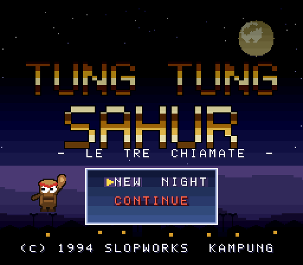
</p>

<p align="center">
  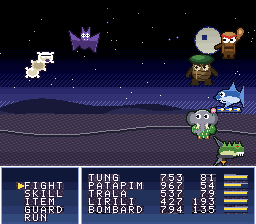
  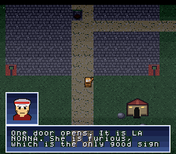
</p>

It is a real 4MB LoROM `.sfc` that runs on hardware and on any accurate
emulator. **[Download the ROM from the v0.001
release.](https://github.com/Ferine/tung-tung-rpg/releases/tag/v0.001)**

---

## The story

A pilgrim walks east. At each stage he meets a guardian who is not evil, only
wrong — beats them, and gains them. By the last act the party is five things
that should not be able to stand each other, walking in step.

SLOP is the material of this world. Not an insult, the substance. Everyone here
was generated, everyone knows it, and none of them find it interesting. A shark
has three shoes. A tree has legs, and the wrong number of them. A crocodile is
also an aeroplane. That is simply what they were made out of, in about four
seconds, and they have all had a month to get over it.

The antagonist is slop that wants to stay smooth: an infinite, comfortable,
frictionless feed where nothing else ever happens and everybody is very relaxed
about that. The party is slop that decided to **get up**. That is the only
difference between them and it is the whole game.

The places are Indonesian, because Tung Tung Tung Sahur is. The people are
Italian, because they are. That collision is the genre, not a mistake in it.

**[`STORY.md`](STORY.md) has all six acts, the cast and the cameos.**

## The party

Each companion is a different argument against lying down.

| | how they refuse | joins |
|---|---|---|
| **TUNG TUNG TUNG SAHUR** — il tamburo | on principle | the start |
| **BRR BRR PATAPIM** — le radici | by standing there, and taking the hits so nobody else has to | Atto II |
| **TRALALERO TRALALA** — tre scarpe | by never stopping | Atto III |
| **LIRILÌ LARILÀ** — il tempo | by remembering | Atto IV |
| **BOMBARDIRO CROCODILO** — l'ordigno | loudly, having been on the wrong side | Atto V |

## The world

Seven regions, each with its own tileset, palette and battle backdrop:
**Kampung Sahur** the village, the east road, **Hutan** the forest that stopped
moving, **Pantai** where the Sleep runs into water and stops, **Padang Garam**
where nothing has grown since before the Sleep, **Langit Besi** a fortress held
up by nothing anybody can point at, and **Malam Panjang** — not a place so much
as a held breath.

Six of the seven have something moving in them: water crests that travel, a
lantern that breathes, mushroom caps that take turns being lit, forge mouths
that swell, and the tear in Malam Panjang pulling itself open. The salt flat has
nothing that moves, which is the point of the salt flat.

| | | | |
|:---:|:---:|:---:|:---:|
| 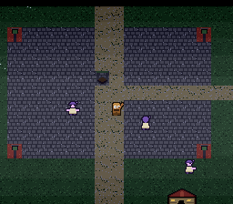 | 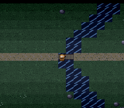 | 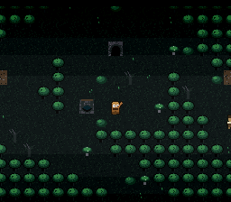 |  |
| **Kampung Sahur** | **the east road** | **Hutan** | **Pantai** |
| 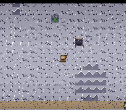 | 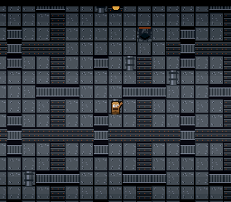 | 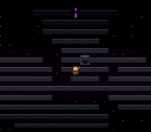 | |
| **Padang Garam** | **Langit Besi** | **Malam Panjang** | |

Each region gets its own sky, drawn a scanline at a time — a smooth gradient
rather than dithered bands, a vignette over the field, and water that shimmers
under it. The title screen is a picture: a village under a moon, with the logo's
shine and the star field animated without redrawing a single tile. Encounters
drop through a 256-colour Mode 7 night vortex: the field rotates and rushes at
the camera before the existing mosaic wipe closes over it.

### The sleepwalkers

The regions are not empty, and the people in them are not awake. Twenty-two
figures drift about the seven maps — villagers in nightcaps with their arms out
in front of them, taller ones still in the day's clothes, and the five-legged
cat from the opening, asleep, standing up. They wander a few cells from wherever
the night caught them, they walk into walls and stand there facing them, and
they never say a word, because there is nobody home to say it. They are solid:
you can no more walk through one than talk to them.

The village has six. The salt flat has two, which is as many as the salt flat
has ever had.

<p align="center">
  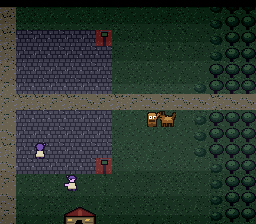
</p>

<p align="center">
  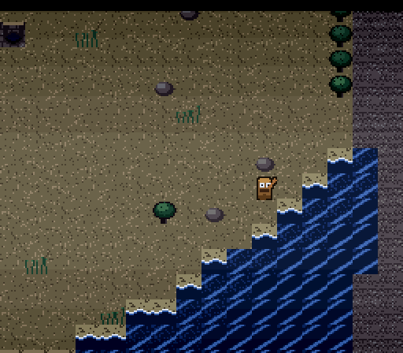
  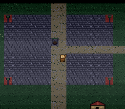
</p>

## Battles

Active-time, in the FF4 shape: a gauge per combatant, FIGHT / SKILL / ITEM /
GUARD / RUN, a staggered two-column party of up to five, target selection with
the enemy named, damage numbers. Fourteen skills learned by level, eight items,
charms that take one equipment slot each.

Six acts, five guardians, and a final boss that fights in two shapes: the first
pleads, the second stops being polite.

Twenty-four enemy designs, six of them 64x64 bosses. Six are the canon itself —
Cappuccino Assassino, Bombombini Gusini, Boneca Ambalabu, Blueberrinni
Octopusini, Glorbo Fruttodrillo and La Vacca Saturno Saturnita — one face per
region.

Dialogue is JRPG-style: eight 32x32 busts in a frame above the message box, and
the game works out who is speaking from the line itself.

<p align="center">
  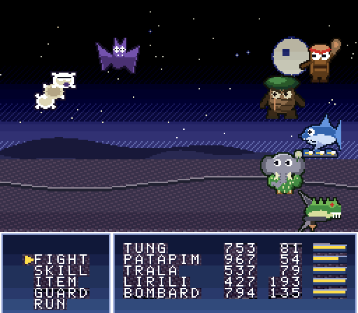
  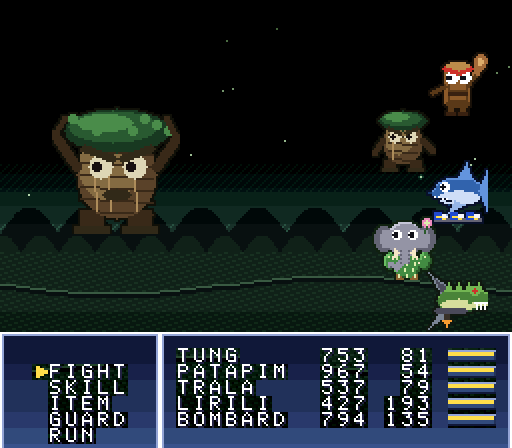
</p>

## Playing it

| button | does |
|---|---|
| **D-pad** | walk; move the cursor |
| **A** | confirm; advance dialogue |
| **B** | cancel, back out of a menu |
| **START** | open the field menu; also advances dialogue |
| **L / R** | flip the shop page |

There is no talk button — walk into somebody, or into a door, and it happens.

<p align="center">
  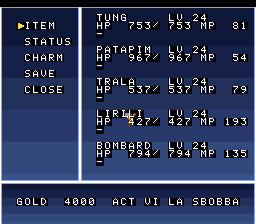
  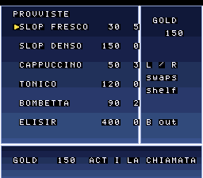
</p>

Talk to LA NONNA before the village will let you east. After that the road is
gated one act at a time. Wells restore the party *and* save; there is one before
each guardian, because arriving at a boss on a third of a bar is bookkeeping,
not difficulty. The shop in the village sells supplies and charms. The save is
battery-backed, so CONTINUE picks up where you left it.

**SLEEP is the mechanic to actually think about.** The Sleepers inflict it, a
sleeping character's gauge stops, and Tung's **SAHUR!** clears it from the whole
party at once while hitting everything on the field. Tung himself never sleeps.
In the last act that stops being a convenience and becomes the only reply the
game has.

## The music

Thirteen original symphonic tracks, played on an eighteen-piece orchestra:
violin, viola and cello sections, contrabass, horn, trumpet, tenor trombone,
oboe, flute, pipe organ, harp, glockenspiel, timpani, and the kentongan — the
slit drum the game is named after. Recurring leitmotifs move from woodwind hymn
to brass overture to cathedral-scale battle music. Eight sound effects are
synthesised, because a menu blip wants a swept sine and not a recording.

The instruments are cut from CC0 recordings rather than synthesised, which is
what a 16-bit RPG score actually is: FF6 and Chrono Trigger are an orchestra
sliced into a few hundred bytes per instrument and played back through the
SPC700. See [`SAMPLES.md`](SAMPLES.md) for the sources and the licence.

---

## Build

Prerequisites: Python 3.10 or newer, GNU Make, and
[pvsneslib](https://github.com/alekmaul/pvsneslib).

```sh
export PVSNESLIB_HOME=/path/to/pvsneslib
make
```

That is the whole build — the generated graphics and tracker modules are kept in
the repository, so nothing has to be downloaded first. The ROM is a build
artifact and is deliberately not stored here.

Everything on screen is generated by the Python in this directory: no art
program, no tracker, no sprite sheets drawn by hand. `gen_assets.py` is the
whole pipeline. Which is fitting, because so is everybody in it.

**[`TECHNICAL.md`](TECHNICAL.md)** is the hardware side — the layer and VRAM
layout, the raster effects, how the art and the orchestra are generated, the
tools, and the eight bugs worth writing down.

## Contributing

Bug reports and focused patches are welcome; see
[`CONTRIBUTING.md`](CONTRIBUTING.md). Generated ROMs, downloaded sample WAVs,
compiler output, emulator saves, and development captures should not be
committed.

## License

The project's original code and assets are available under the MIT License; see
[`LICENSE`](LICENSE). The source recordings used by the music pipeline are
independently dedicated under CC0-1.0; see [`SAMPLES.md`](SAMPLES.md).
